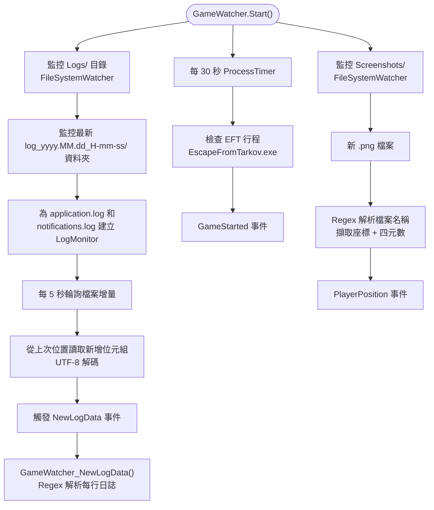
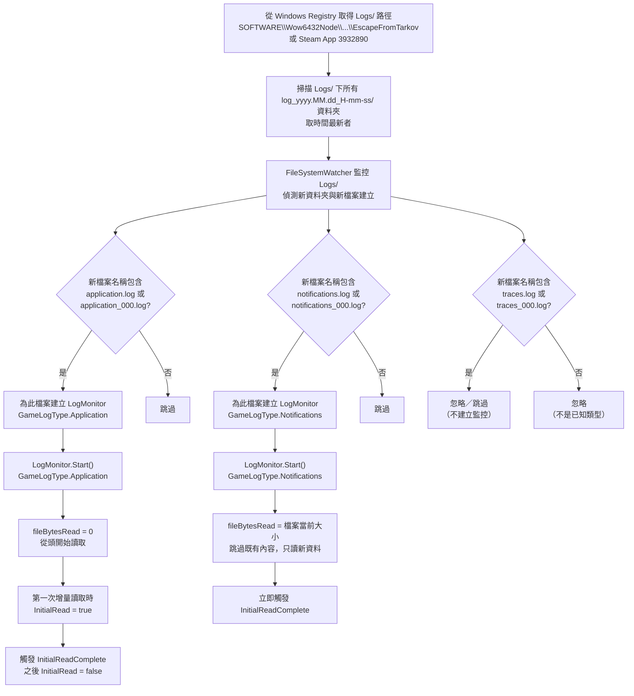
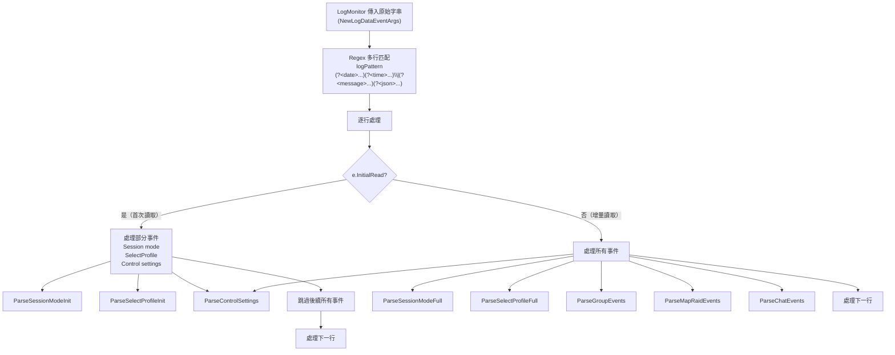
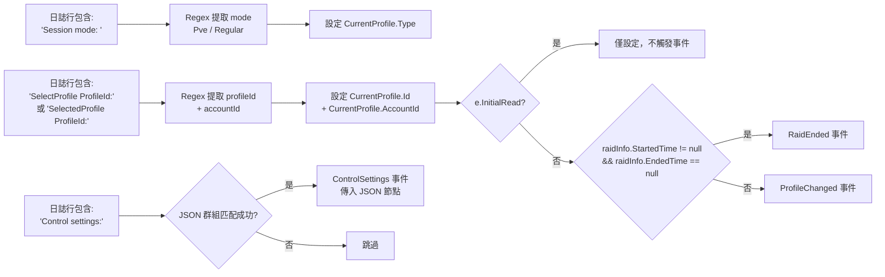
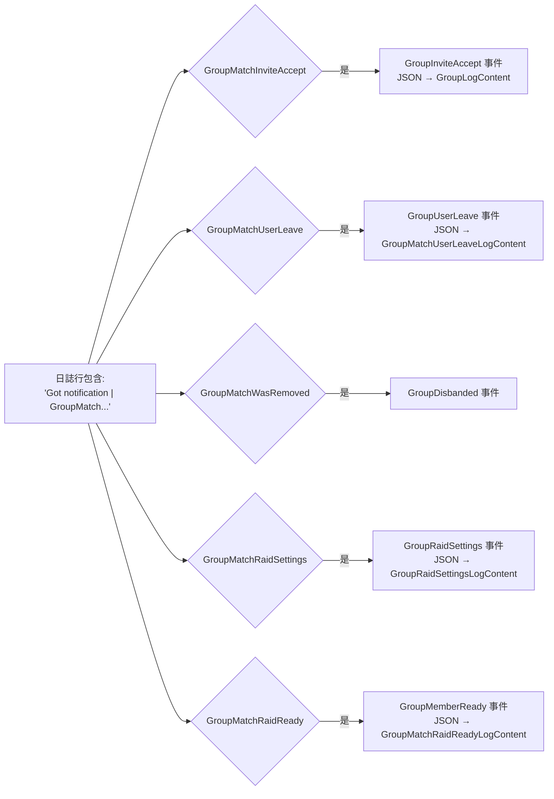
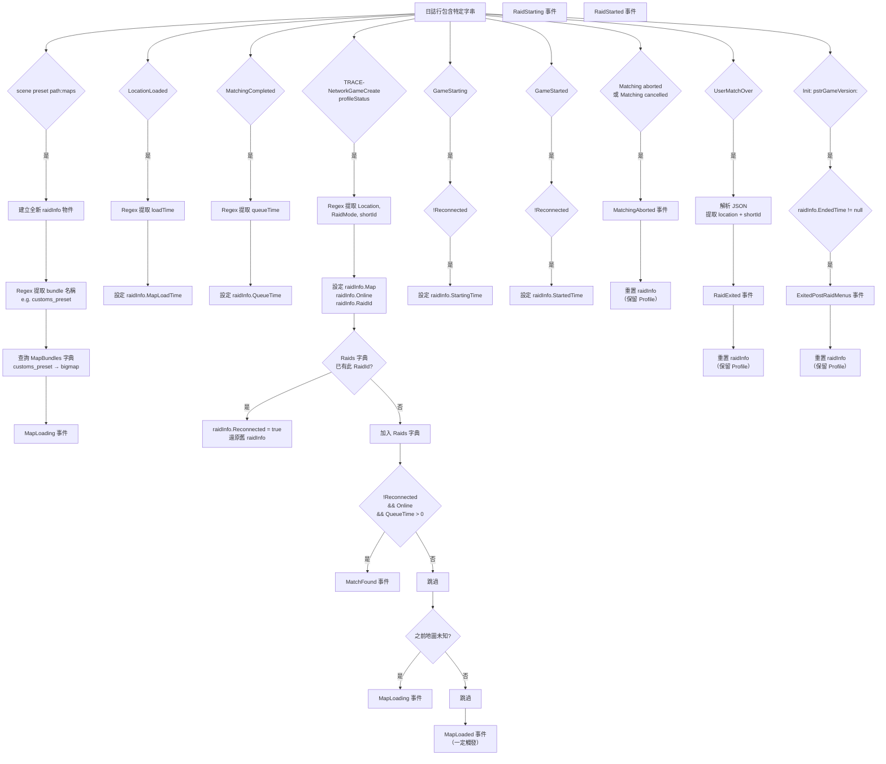
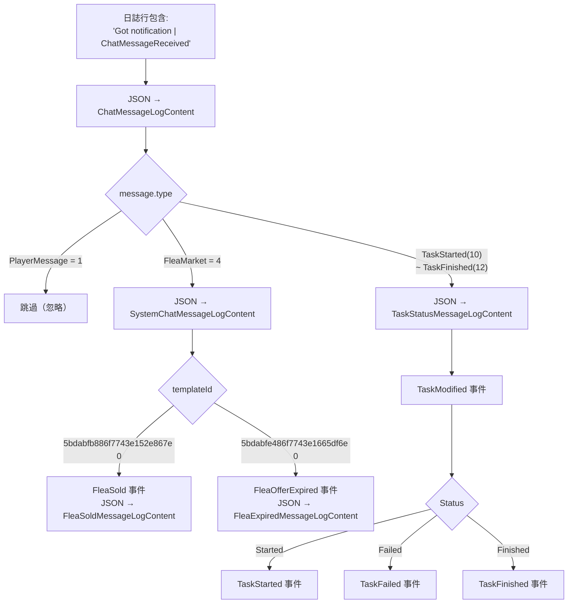
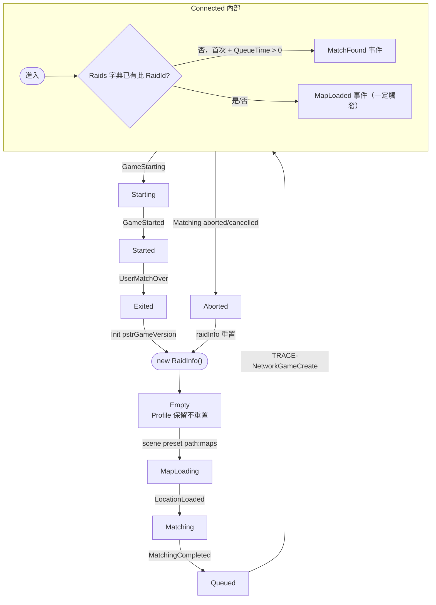

# TarkovMonitor 事件判定流程圖

> 源碼：`reference/TarkovMonitor/TarkovMonitor/GameWatcher.cs`（1110 行）
>
> 核心方法：`GameWatcher_NewLogData()`（328-597 行）

---

## 總體架構



---

## 日誌檔案的選取邏輯

### 目錄結構

```
{EFT安裝目錄}/Logs/
├── log_2024.01.15_10-30-45/      # 每場遊戲連線建立一個資料夾
│   ├── application.log            # 主遊戲日誌（地圖載入、配對、遊戲狀態）
│   ├── application_000.log        # 輪替備份（檔案過大時自動產生）
│   ├── notifications.log          # 遊戲內通知（組隊、聊天、跳蚤市場、任務）
│   ├── notifications_000.log
│   ├── traces.log                 # 追蹤日誌（目前未使用，直接跳過）
│   └── traces_000.log
└── log_2024.01.15_12-15-20/
    └── ...
```

### 判斷流程



### 三種日誌類型的差異

| 類型 | 檔案名稱 | 初始讀取策略 | 事件來源 |
|------|----------|-------------|----------|
| `Application` | `application.log` / `application_000.log` | 從頭讀取（`fileBytesRead=0`） | Profile、地圖、戰局、配對、控制設定 |
| `Notifications` | `notifications.log` / `notifications_000.log` | 跳過既有內容（`fileBytesRead=檔案大小`） | 組隊、聊天、跳蚤市場、任務 |
| `Traces` | `traces.log` / `traces_000.log` | **不監控**（直接 `continue`） | 無 |

### 初始讀取（InitialRead）的影響

Application 日誌的第一次增量資料會被標記為 `InitialRead=true`，此時 **只處理**：
- `Session mode:` → 設定 Profile type
- `SelectProfile/SelectedProfile ProfileId:` → 設定 Profile ID
- `Control settings:` → 觸發 ControlSettings 事件

其餘所有事件（組隊、地圖、戰局、聊天等）在 `InitialRead=true` 時全部跳過，避免重複觸發歷史事件。

### 歷史日誌回讀（ProcessLogs）

`ProcessLogs()` 用於從斷點回讀歷史日誌：
1. 從 `GetLogFolders()` 取得所有 `log_*/` 資料夾（按時間排序）
2. 在每個資料夾中掃描 `application.log` / `notifications.log`（跳過 `traces.log` 與未知檔案）
3. 逐行 Regex 匹配，依時間範圍過濾（`>= breakpoint.Date` 且 `< nextProfile.Date`）
4. 對每條匹配行呼叫 `GameWatcher_NewLogData()`，與即時監控共用相同的事件判定邏輯

---

## 日誌行解析流程



---

## 事件判定決策樹

### 1. Profile 切換事件（Initial Read 也處理）



### 2. 組隊事件（僅增量讀取）



### 3. 地圖與戰局事件（僅增量讀取，核心流程）



### 4. 聊天與跳蚤市場事件



---

## 完整事件列表

| 事件 | 觸發時機 | 資料來源 |
|------|----------|----------|
| `GameStarted` | EFT 程序首次被偵測到 | ProcessTimer (30s) |
| `ProfileChanged` | 切換 Profile（非初始讀取） | application.log |
| `ControlSettings` | 讀取控制設定 | application.log |
| `GroupInviteAccept` | 組隊邀請被接受 | notifications.log |
| `GroupUserLeave` | 隊員離開隊伍 | notifications.log |
| `GroupDisbanded` | 隊伍解散 | notifications.log |
| `GroupRaidSettings` | 隊長設定戰局參數 | notifications.log |
| `GroupMemberReady` | 隊員準備就緒 | notifications.log |
| `MapLoading` | 地圖開始載入 / 偵測到地圖 | application.log |
| `MatchFound` | 配對完成（僅首次，非重連） | application.log |
| `MapLoaded` | 地圖載入 + 連線建立（一定觸發） | application.log |
| `MatchingAborted` | 取消配對 | application.log |
| `RaidStarting` | PMC 倒數開始（或 Scav 直接開始） | application.log |
| `RaidStarted` | 正式進入戰局 | application.log |
| `RaidExited` | 戰局結束撤離 | notifications.log |
| `RaidEnded` | 切換 Profile 時結束前一個戰局 | application.log |
| `ExitedPostRaidMenus` | 返回主選單 | application.log |
| `FleaSold` | 跳蚤市場物品售出 | notifications.log |
| `FleaOfferExpired` | 跳蚤市場報價過期 | notifications.log |
| `TaskModified` | 任務狀態變更 | notifications.log |
| `TaskStarted` | 任務開始（= TaskModified 的子集） | notifications.log |
| `TaskFailed` | 任務失敗（= TaskModified 的子集） | notifications.log |
| `TaskFinished` | 任務完成（= TaskModified 的子集） | notifications.log |
| `PlayerPosition` | 遊戲內截圖時 | Screenshots/*.png 檔案 |
| `InitialReadComplete` | 所有 LogMonitor 初次讀取完成 | LogMonitor |

---

## RaidInfo 狀態機



---

## 註解

- **InitialRead 邏輯**：非 `Application` 類型的日誌（`notifications.log`）在 LogMonitor 啟動時直接跳到檔案末尾，跳過既有內容。`Application` 類型的日誌在首次增量讀取完成後觸發 `InitialReadComplete`，在此之前的資料只處理 Profile/ControlSettings 事件，不觸發其他事件。
- **raidInfo 生命週期**：`raidInfo` 在 `MapLoading` 時新建，在 `MatchingAborted` / `UserMatchOver` / `ExitedPostRaidMenus` 時重置（保留 `Profile` 欄位）。
- **地圖名稱解析**：透過 `MapBundles` 字典將 Bundle 名稱（如 `customs_preset`）映射到已知地圖 ID（如 `bigmap`）。
